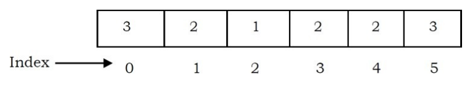

tags:: [[DSA]], [[Data Structure]]

- # Array
	- 
	- Array the simplest [[Data Structure]]
	- One memory block is allocated for the entire array to hold the elements of the array. The array elements can be accessed in constant time by using the index of the particular element as the subscript.
		- ### Constant Time for Accessing Array Elements
			- To access an array element, the address of an element is computed as an offset from the base address of the array and one multiplication is needed to compute what is supposed to be added to the base address to get the memory address of the element. First the size of an element of that data type is calculated and then it is multiplied with the index of the element to get the value to be added to the base address.
			- This process takes one multiplication and one addition. Since these two operations take constant time, we can say the array access can be performed in constant time.
	- ### Advantages of Arrays
		- Simple and easy to use
		- Faster access to the elements (constant access)
	- ### Disadvantages of Arrays
		- Pre-Allocates all needed memory up front and wastes memory space for indices in the array that are empty.
		- Fixed size
			- The size of the array is static (specify the array size before using it).
			- This can be solved with a [[Dynamic Array]].
		- One block allocation
			- To allocate the array itself at the beginning, sometimes it may not be possible to get the memory for the complete array (if the array size is big).
		- Complex position-based insertion: To insert an element at a given position, we may need to shift the existing elements. This will create a position for us to insert the new element at the desired position. If the position at which we want to add an
		  element is at the beginning, then the shifting operation is more expensive.