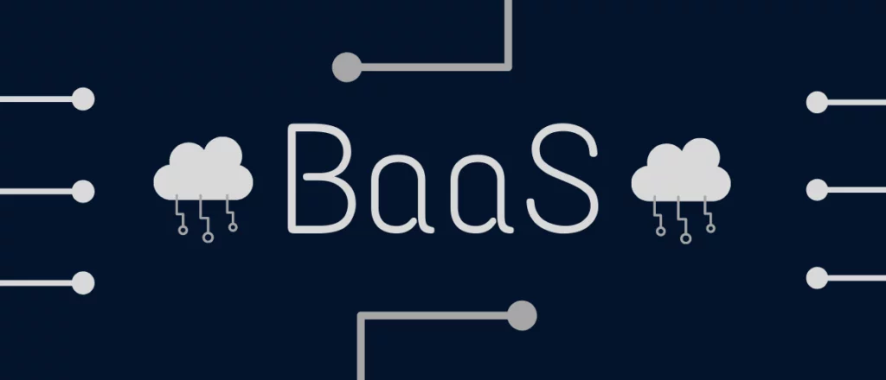

- # BaaS: Backend as a Service
	- 
	- ## What is a BaaS
		- A Backend as a Service is a way to outsource the majority of the behind the scenes aspects of an application to prebuilt backend infrastructure.
		- Building a backend which doesn't get obliterated when it goes live to prod is kind of a hard thing.  So we can outsource some of these burdens to a backend to a BaaS provider.
		- A BaaS will be a comprehensive suite of tools like Authentication, Authorization, Database, Real-Time, API, and other required application development
		- BaaS providers empower developers to focus more on front-end development and user experience, as they can rely on the pre-existing backend infrastructure and services the BaaS platform provides.
	- ## Notable features of a BaaS
		- Authentication and Authorization
			- Building auth is a pain and making it secure is like mission impossible so most of the BaaS providers give the ability to do Authentications and Authorization which will always be better than what I build. So most BaaS provides have built-in user authentication and authorization mechanisms, allowing developers to manage user registration, login, and access control for their applications.
		- Database Management
			- Most of the BaaS's come with a built in database which may include both SQL and NoSQL databases and these have an easy to use API to interact with the database and most if these databases have extra features like Real-Time (Implementing Real-time is almost impossible), Authorization and many more good to have features which will take ages to implement.
		- File Storage
			- File storage. Just trying to use the [[AWS S3]] is a pain and holding references to those files in Database and adding Authorization and securing those files are a whole other game. So BaaS providers often include file storage capabilities, enabling developers to store and manage files such as images, documents, and media assets associated with their applications.
		- Real-time Functionality
			- Real-time the on enemy to rule them all. Building and scaling Real-time systems are a almost hard as naming things. We have to build services which implement [[CDC]] and send those changes to [[Redis]] Pub/Sub or a Message Broker like [[Kafka]] the we have to push those through [[WebSockets]] to the client. Then we have to scale this stateful service.
			- So most BaaS platforms often provide real-time communication features, such as chat, push notifications, and live updates. These features allow developers to incorporate real-time interactions into their applications. We can add Real-time with just a single line of code.
		- APIs and SDKs
			- A BaaS combines all the desperate infrastructure and hides it under a Façade and give the developer easy to use APIs and software development kits (SDKs) that simplify integration with various backend services. These APIs and SDKs enable developers to easily access functionalities such as data storage, user management, and third-party service integration.
		- Scalability and Infrastructure Management
			- Most of the BaaS providers handle the underlying infrastructure and server management, ensuring scalability and high availability of the backend services. This relieves developers from the burden of infrastructure maintenance and scalability planning. But there some self hosted BaaS products which incase the developer would have to manage the scale and infrastructure by them selves.
		- Analytics and Monitoring
			- These platforms often provide tools for monitoring application usage, tracking user behavior, and analyzing app performance. These features help developers gain insights into their application's usage patterns and performance metrics.
		- Social Media Integration
			- Many BaaS providers offer integrations with popular social media platforms, allowing developers to leverage social login, sharing, and other social features within their applications. With social login features the user will be able to do Single Sign-On which is more convenient.
		- Backend Customization
			- While BaaS focuses on providing prebuilt backend functionalities, it often allows developers to customize certain aspects of the backend infrastructure to meet specific application requirements.
			- We could use feature like [[Serverless Functions]] and [[Webhooks]] to implement custom business logic in the backend.
		- Security and Compliance
			- BaaS platforms prioritize security and data protection, implementing measures such as encryption, secure API access, and compliance with industry regulations to safeguard user data and ensure application security.
	- ## Some of the cons of using a BaaS
		- While Backend as a Service (BaaS) offers numerous advantages, there are also some potential challenges or drawbacks associated with its use. Here are a few problems that can arise when using BaaS
			- Limited Customization
				- BaaS platforms provide prebuilt backend functionalities, which may limit the level of customization available for specific application requirements. If your application has unique or complex backend needs, you may find it challenging to customize the BaaS infrastructure accordingly.
			- Vendor Lock-In
				- When you rely heavily on a specific BaaS provider for your backend infrastructure, it can create vendor lock-in. Switching to a different provider or migrating away from the BaaS platform might be difficult and time-consuming, potentially leading to dependency on a single provider.
			- Integration Complexity
				- While BaaS platforms offer APIs and SDKs for integration, integrating the BaaS backend with existing systems or third-party services can sometimes be complex. Compatibility issues, differing data models, or limited integration options can pose challenges during the integration process.
			- Data Security and Compliance
				- Entrusting sensitive user data to a BaaS provider raises concerns about data security and compliance. It is crucial to thoroughly evaluate the security measures and compliance standards implemented by the BaaS platform to ensure that your users' data is adequately protected and meets legal requirements.
			- Performance and Scalability
				- BaaS providers manage the backend infrastructure on behalf of multiple clients, which means the performance and scalability of the services may be impacted by the load from other applications. In high-demand scenarios, there is a possibility of experiencing decreased performance or limited scalability compared to a dedicated backend setup.
			- Dependency on Third-Party Services
				- BaaS often relies on external services for specific functionalities like authentication, push notifications, or file storage. If these services experience downtime or disruptions, it can directly affect the functionality and user experience of your application.
			- Cost Considerations
				- While BaaS can offer cost savings by eliminating the need for extensive backend infrastructure development and maintenance, it is essential to carefully evaluate the pricing models of BaaS providers. Costs can increase as your application scales or if you require additional services beyond the free-tier offerings.
		- Despite these challenges, BaaS can still be a valuable solution for many development projects. It is crucial to weigh the advantages and disadvantages, consider your application's specific requirements, and select a BaaS provider that aligns well with your needs. Nothing is rainbows and butterflies. So choose wisely.
	- ### List of BaaS Providers
		- [[Firebase]]
		- [[AWS Amplify]]
		- [[Supabase]]
		- [[Nhost]]
		- [[Appwrite]]
		- [[PocketBase]]
		- [[8base]]
		- [[Realm]]
		- [[Parse]]