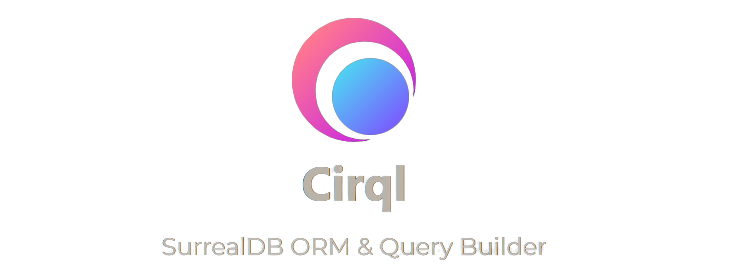

tags:: [[SurrealDB]]

- # Cirql: SurrealDB ORM & Query Builder
	- 
	- ## Cirql
		- Cirql (pronounced Circle) is a lightweight and simpe [[ORM]] and [[Query Builder]] for [[SurrealDB]] providing fully type-safe queries and [[Zod]] powered parsing & validation.
		- It is built with flexibility in mind and leaves the user with complete control over their queries. While still providing powerful APIs to query your database in a concise manner.
		- Cirql is developed by the cool folks at [Starlane Studios](https://starlane.studio/).
	- ## Cirql Features
		- Connect to SurrealDB over stateful WebSockets or stateless HTTP requests
		- Support for query batching & transactions
		- Zod-powered schema validation of query results
		- Full TypeScript support with Zod schema inference
		- Write flexible queries using the Query Writer API
		- Support for raw query strings and native Surreal functions
		- Works both in browser and backend environments
	- ## [[Cirql Installation]]
		- {{embed ((649c425a-3f87-4002-81f6-6acdd51f00c8))}}
	- ## [[Cirql Usage]]
		- Following query fetches up to 5 organisations that are enabled and have the given user as a member. The result is parsed and validated using the provided [[Zod Schema]]
			- ```typescript
			  import { RecordSchema, select } from 'cirql';
			  import { z } from 'zod';
			  
			  // Define your Zod schemas
			  const Organisation = RecordSchema.extend({
			      name: z.string(),
			      isEnabled: z.boolean(),
			      createdAt: z.string()
			  });
			  
			  // Execute a select query
			  const organisations = await cirql.execute({
			      query: select()
			          .from('organisation')
			          .with(Organisation) // Specify the schema
			          .limit(5)
			          .where({
			              isEnabled: true,
			              members: any(userId)
			          })
			  });
			  ```
	- ## Cirql Resources
		- [SurrealDB ORM & Query Builder | Cirql](https://cirql.starlane.studio/)
		- [GitHub - StarlaneStudios/cirql: 🔧 A flexible SurrealDB ORM & query builder with Zod powered validation 🏋️‍♂️](https://github.com/StarlaneStudios/cirql)
	-