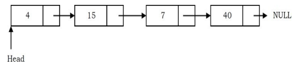

# Singly Linked List
	- Generally “linked list” means a singly linked list. This list consists of a number of nodes in which
	  each node has a next pointer to the following element. The link of the last node in the list is
	  NULL, which indicates the end of the list.
	- 
	- Operations in a Singly Linked List
		- Traversing the list
		- Inserting an item in the list
		- Deleting an item from the list
	- ### Traversing a Singly Linked List
		- Let us assume that the head points to the first node of the list. To traverse the list we do the
		  following
			- Follow the pointers.
			- Display the contents of the nodes (or count) as they are traversed.
			- Stop when the next pointer points to NULL.
	- ### Singly Linked List Insertion
		- Insertion into a singly-linked list has three cases
			- Inserting a new node before the head (at the beginning)
			- Inserting a new node after the tail (at the end of the list)
			- Inserting a new node at the middle of the list (random location)
		- #### Inserting a Node in Singly Linked List at the Beginning
			- In this case, a new node is inserted before the current head node. Only one next pointer needs to be modified (new node’s next pointer) and it can be done in two steps.
				- Update the next pointer of new node, to point to the current head
	- ## Implement of singly linked list
		- ```c
		  #include <stdio.h>
		  #include <stdlib.h>
		  
		  struct Node {
		      int data;
		      struct Node* next;
		  };
		  
		  struct Node* createNode(int data) {
		      struct Node* newNode = (struct Node*)malloc(sizeof(struct Node));
		      if (newNode == NULL) {
		          printf("Memory allocation failed\n");
		          exit(EXIT_FAILURE);
		      }
		      newNode->data = data;
		      newNode->next = NULL;
		      return newNode;
		  }
		  
		  void insertAtBeginning(struct Node** head, int data) {
		      struct Node* newNode = createNode(data);
		      newNode->next = *head;
		      *head = newNode;
		  }
		  
		  void insertAtEnd(struct Node** head, int data) {
		      struct Node* newNode = createNode(data);
		      if (*head == NULL) {
		          *head = newNode;
		          return;
		      }
		      struct Node* temp = *head;
		      while (temp->next != NULL) {
		          temp = temp->next;
		      }
		      temp->next = newNode;
		  }
		  
		  void display(struct Node* head) {
		      struct Node* temp = head;
		      while (temp != NULL) {
		          printf("%d -> ", temp->data);
		          temp = temp->next;
		      }
		      printf("NULL\n");
		  }
		  
		  int main() {
		      struct Node* head = NULL;
		  
		      insertAtBeginning(&head, 5);
		      insertAtBeginning(&head, 10);
		      insertAtEnd(&head, 15);
		  
		      printf("Linked List: ");
		      display(head);
		  
		      return 0;
		  }
		  ```
			- ```shell
			  Linked List: 10 -> 5 -> 15 -> NULL
			  ```
		- ```c++
		  #include <iostream>
		  
		  struct Node {
		      int data;
		      Node* next;
		  };
		  
		  Node* createNode(int data) {
		      Node* newNode = new Node();
		      newNode->data = data;
		      newNode->next = nullptr;
		      return newNode;
		  }
		  
		  void insertAtBeginning(Node*& head, int data) {
		      Node* newNode = createNode(data);
		      newNode->next = head;
		      head = newNode;
		  }
		  
		  void insertAtEnd(Node*& head, int data) {
		      Node* newNode = createNode(data);
		      if (head == nullptr) {
		          head = newNode;
		          return;
		      }
		      Node* temp = head;
		      while (temp->next != nullptr) {
		          temp = temp->next;
		      }
		      temp->next = newNode;
		  }
		  
		  void display(Node* head) {
		      Node* temp = head;
		      while (temp != nullptr) {
		          std::cout << temp->data << " -> ";
		          temp = temp->next;
		      }
		      std::cout << "NULL\n";
		  }
		  
		  int main() {
		      Node* head = nullptr;
		  
		      insertAtBeginning(head, 5);
		      insertAtBeginning(head, 10);
		      insertAtEnd(head, 15);
		  
		      std::cout << "Linked List: ";
		      display(head);
		  
		      return 0;
		  }
		  ```
			- ```shell
			  Linked List: 10 -> 5 -> 15 -> NULL
			  ```
		- ```go
		  package main
		  
		  import "fmt"
		  
		  type Node struct {
		  	data int
		  	next *Node
		  }
		  
		  func createNode(data int) *Node {
		  	return &Node{data: data, next: nil}
		  }
		  
		  func insertAtBeginning(head **Node, data int) {
		  	newNode := createNode(data)
		  	newNode.next = *head
		  	*head = newNode
		  }
		  
		  func insertAtEnd(head **Node, data int) {
		  	newNode := createNode(data)
		  	if *head == nil {
		  		*head = newNode
		  		return
		  	}
		  	temp := *head
		  	for temp.next != nil {
		  		temp = temp.next
		  	}
		  	temp.next = newNode
		  }
		  
		  func display(head *Node) {
		  	temp := head
		  	for temp != nil {
		  		fmt.Printf("%d -> ", temp.data)
		  		temp = temp.next
		  	}
		  	fmt.Println("NULL")
		  }
		  
		  func main() {
		  	var head *Node
		  
		  	insertAtBeginning(&head, 5)
		  	insertAtBeginning(&head, 10)
		  	insertAtEnd(&head, 15)
		  
		  	fmt.Print("Linked List: ")
		  	display(head)
		  }
		  ```
			- ```shell
			  Linked List: 10 -> 5 -> 15 -> NULL
			  ```
		- ```c#
		  using System;
		  
		  class Node
		  {
		      public int data;
		      public Node next;
		  }
		  
		  class LinkedList
		  {
		      static Node createNode(int data)
		      {
		          Node newNode = new Node();
		          newNode.data = data;
		          newNode.next = null;
		          return newNode;
		      }
		  
		      static void insertAtBeginning(ref Node head, int data)
		      {
		          Node newNode = createNode(data);
		          newNode.next = head;
		          head = newNode;
		      }
		  
		      static void insertAtEnd(ref Node head, int data)
		      {
		          Node newNode = createNode(data);
		          if (head == null)
		          {
		              head = newNode;
		              return;
		          }
		          Node temp = head;
		          while (temp.next != null)
		          {
		              temp = temp.next;
		          }
		          temp.next = newNode;
		      }
		  
		      static void display(Node head)
		      {
		          Node temp = head;
		          while (temp != null)
		          {
		              Console.Write(temp.data + " -> ");
		              temp = temp.next;
		          }
		          Console.WriteLine("NULL");
		      }
		  
		      static void Main(string[] args)
		      {
		          Node head = null;
		  
		          insertAtBeginning(ref head, 5);
		          insertAtBeginning(ref head, 10);
		          insertAtEnd(ref head, 15);
		  
		          Console.Write("Linked List: ");
		          display(head);
		      }
		  }
		  ```
			- ```shell
			  Linked List: 10 -> 5 -> 15 -> NULL
			  ```
		- Singly Linked List can be the easiest linked list and