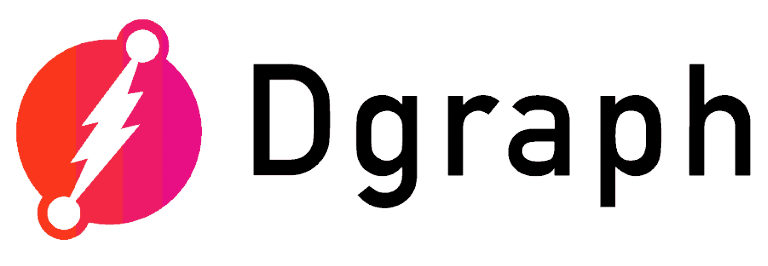

tags:: [[Graph Database]], [[GraphQL]], [[Go]]

- # Dgraph: The [[Graph Database]] which Speaks [[GraphQL]]
	- 
	- ## Dgraph Resources
		- [Dgraph | GraphQL Cloud Platform, Distributed Graph Engine](https://dgraph.io/)
		- [GitHub - dgraph-io/dgraph: Native GraphQL Database with graph backend](https://github.com/dgraph-io/dgraph)
		- [Get started with Dgraph](https://dgraph.io/docs/)