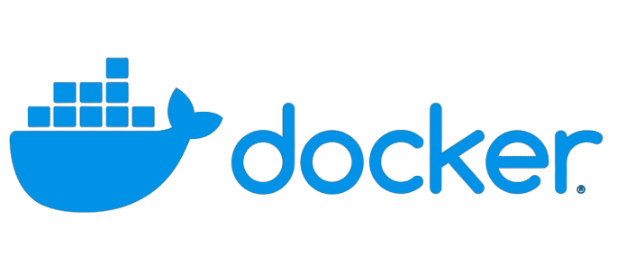

tags:: [[Go]]

- # Docker: A way to perform operating-system-level virtualization of processes
	- {:height 344, :width 749}
	- ## Docker Resources
		- [Docker: Accelerated, Containerized Application Development](https://www.docker.com/)
		- [GitHub - moby/moby: Moby Project - a collaborative project for the container ecosystem to assemble container-based systems](https://github.com/moby/moby)
		- [Docker Docs: How to build, share, and run applications | Docker Documentation](https://docs.docker.com/)
		- [Docker](https://hub.docker.com/)