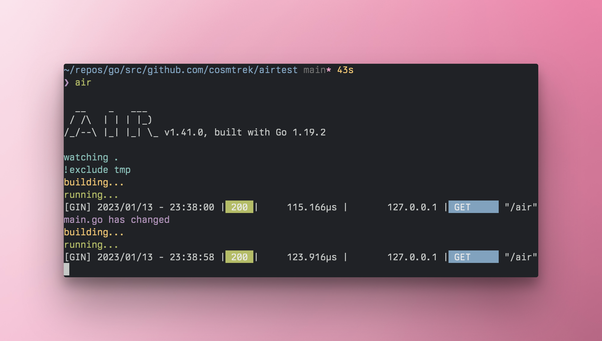

# Air: live-reloading for [[Go]]
	- 
	- ## [[Go]] Air
		- Go air is a CLI to watch your go project and live reload on changes.
	- ## Install air
		- ### With install.sh
			- ```shell
			  # binary will be $(go env GOPATH)/bin/air
			  curl -sSfL https://raw.githubusercontent.com/cosmtrek/air/master/install.sh | sh -s -- -b $(go env GOPATH)/bin
			  
			  # or install it into ./bin/
			  curl -sSfL https://raw.githubusercontent.com/cosmtrek/air/master/install.sh | sh -s
			  
			  air -v
			  ```
		- ### With go
	- ## How to Setup Air toml
		- ```toml
		  root = "."
		  testdata_dir = "testdata"
		  tmp_dir = "tmp"
		  
		  [build]
		    args_bin = []
		    bin = "tmp\\main.exe"
		    cmd = "go build -o ./tmp/main.exe ./cmd"
		    delay = 0
		    exclude_dir = ["assets", "tmp", "vendor", "testdata"]
		    exclude_file = []
		    exclude_regex = ["_test.go"]
		    exclude_unchanged = false
		    follow_symlink = false
		    full_bin = ""
		    include_dir = []
		    include_ext = ["go", "tpl", "tmpl", "html"]
		    include_file = []
		    kill_delay = "0s"
		    log = "build-errors.log"
		    poll = false
		    poll_interval = 0
		    rerun = false
		    rerun_delay = 500
		    send_interrupt = false
		    stop_on_error = false
		  
		  [color]
		    app = ""
		    build = "yellow"
		    main = "magenta"
		    runner = "green"
		    watcher = "cyan"
		  
		  [log]
		    main_only = false
		    time = false
		  
		  [misc]
		    clean_on_exit = false
		  
		  [screen]
		    clear_on_rebuild = false
		    keep_scroll = true
		  ```