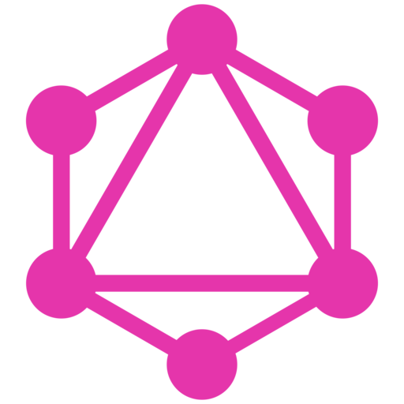

# GraphQL
	- 
	- **GraphQL** is an open-source data query and manipulation language for APIs, and a runtime for executing those queries with existing data. It was developed by Facebook in 2012 and open-sourced in 2015.
	- The primary purpose of GraphQL is to allow clients to specify exactly what data they need, making interactions with the server more efficient. It’s not tied to any specific database or storage engine and is instead backed by existing code and data.
	- ## Here’s how GraphQL typically works
		- **Single Request-Response Cycle**
			- Unlike traditional REST APIs that require multiple round trips to fetch data, GraphQL can fetch all the required data in a single request-response cycle.
		- **Shape of the Response**
			- In GraphQL, the server returns data in the shape of the query sent by the client. This feature allows the client to have more control over the data it receives.
		- **Type System**
			- GraphQL APIs are organized via a type system. The schema, which defines various data types, serves as a contract between the client and the server.
		- **Real-time Updates**
			- GraphQL supports real-time updates with subscriptions, which maintain a steady connection to the server.
		- **Introspection**
			- GraphQL is self-documenting. Through introspection, a GraphQL server can be queried for the types it supports.
	- By employing GraphQL, clients can fetch exactly what they need, nothing more and nothing less. This efficiency leads to faster and more stable applications.
	- GraphQL is widely used in various systems that interact with APIs. It is essential for achieving efficiency and flexibility in such systems. It’s been adopted by many companies, from small startups to large enterprises, and a robust ecosystem of tools and libraries has been developed around it.
	- ## Advantages of GraphQL over REST:
		- **Data Fetching**
			- In REST, to fetch related resources, you often have to make multiple requests to different endpoints. In contrast, GraphQL allows you to get all the data you need in a single request by allowing the client to specify exactly what it needs.
		- **Over-fetching and Under-fetching**
			- With REST, the server defines what data is returned for each resource at each endpoint, which can lead to over-fetching (getting more data than you need) or under-fetching (not getting enough data). GraphQL solves this problem by allowing the client to ask for exactly what it needs.
		- **Versioning**
			- In REST, changing the structure of the data returned by an endpoint often requires versioning the API. With GraphQL, changes can be managed more smoothly because clients only receive the data they ask for.
		- **Real-time Updates**
			- While [[REST]] can be used alongside [[WebSocket]] to get real-time updates, GraphQL has built-in support for subscriptions to push updates to the client.
	- ## Downsides of GraphQL
		- **Performance Concerns**
			- Since GraphQL allows clients to ask for any data they need, it can lead to expensive queries hitting multiple database tables. This can be mitigated with good schema design, query complexity analysis, and setting limits on query depth and complexity.
		- **Caching Complexity**
			- HTTP caching in REST is straightforward and can lead to significant performance benefits. In GraphQL, caching is more complex due to the more dynamic nature of the queries.
		- **Learning Curve**
			- GraphQL has a steeper learning curve than REST. Developers need to understand the type system, queries, mutations, and resolvers, among other things.
		- **Error Handling**
			- Error handling in GraphQL can be more complex compared to REST. In REST, we have standard HTTP status codes to represent different types of errors. In GraphQL, the server always responds with a 200 OK status code and the errors are included in the response body.
		- **Server Side Over Fetching**
			- [[GraphQL N + 1 Problem]] means the server over fetches data.
	- In conclusion, while GraphQL has many advantages over REST, it also has its own set of challenges. The choice between GraphQL and REST depends on the specific needs and constraints of your project. I hope this gives you a more comprehensive understanding of GraphQL! 😊
	- {{video https://www.youtube.com/watch?v=urmi2wbEpGk}}
	- {{video https://www.youtube.com/watch?v=783ccP__No8}}
	- {{video https://www.youtube.com/watch?v=eIQh02xuVw4}}
	- {{video https://www.youtube.com/watch?v=7wzR4Ig5pTI}}