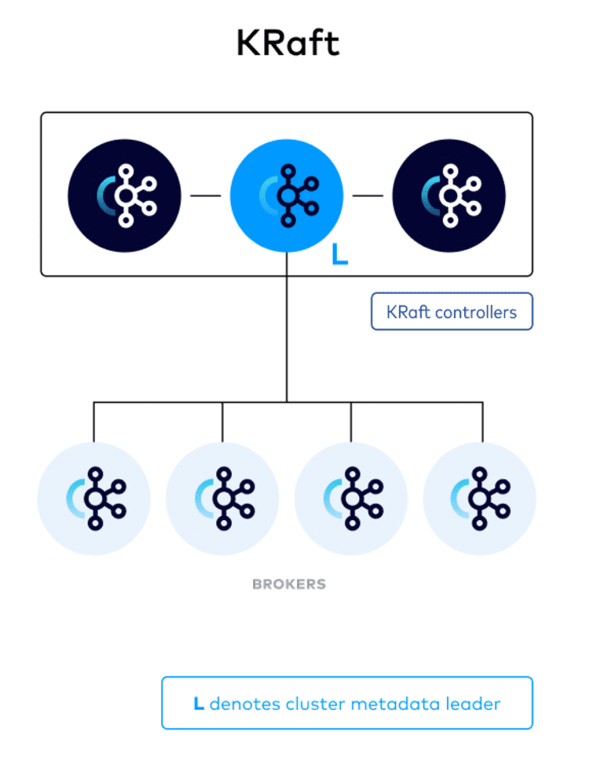

tags:: [[Apache Kafka]], [[Raft]]

- # KRaft
	- 
	- **KRaft (Kafka Raft Metadata mode)** is a distributed consensus protocol that enables Apache Kafka to manage its own metadata internally, eliminating the need for a separate external dependency like ZooKeeper. This streamlines Kafka's architecture and offers several advantages:
	- ## Key Advantages of KRaft
		- **Simplified Architecture**
			- By integrating metadata management within Kafka itself, you no longer need to set up, operate, and maintain ZooKeeper, reducing operational complexity and potential points of failure.
		- **Improved Scalability**
			- KRaft scales efficiently to handle millions of partitions, making it suitable for large-scale deployments and demanding workloads.
		- **Faster Failover**
			- In the event of a broker failure, KRaft ensures near-instantaneous metadata failover for minimal downtime and service disruption.
		- **Enhanced Security**
			- KRaft leverages Kafka's robust authentication and authorization mechanisms, providing a more secure approach to metadata management.
		- **Streamlined Management**
			- Having one system to manage (Kafka) simplifies configuration, authentication, and protocol handling.
	- ## Workings of KRaft
		- **Quorum Controllers**
			- A designated set of Kafka brokers, known as quorum controllers, form a quorum using the Raft consensus protocol.
		- **Event-Based Storage**
			- Metadata changes are stored as events in a dedicated Kafka topic, providing an auditable and replayable history.
		- **Leader Election**
			- One controller acts as the leader, responsible for proposing, replicating, and applying metadata changes.
		- **Consistency and Durability**
			- The Raft protocol ensures that metadata updates are replicated across the quorum and committed durably, guaranteeing consistency and availability.
	- ## When to Use KRaft
		- **New Kafka Clusters**
			- Consider using KRaft in new deployments for simplified management and better scalability.
		- **Existing ZooKeeper-Based Clusters**
			- While migration tools are under development, upgrading existing clusters to KRaft directly is not yet recommended.
	- KRaft is a significant advancement in Kafka architecture, offering a modern, efficient, and scalable approach to metadata management. By eliminating the need for ZooKeeper, it simplifies operations, improves performance, and enhances security for large-scale Kafka deployments.
	- ## KRaft Resources
		- [KRaft - Apache Kafka Without ZooKeeper](https://developer.confluent.io/learn/kraft/)
		- [KRaft Overview | Confluent Documentation](https://docs.confluent.io/platform/current/kafka-metadata/kraft.html)