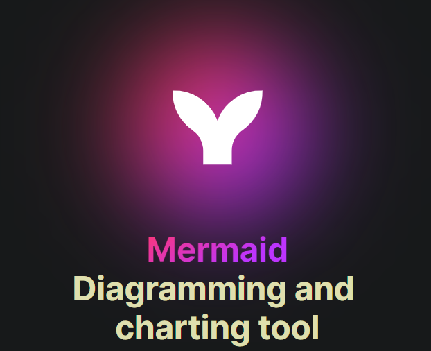

# Mermaid.js: [[JavaScript]] based Diagramming and Charting tool
	- 
	- ## Mermaid.js
		- It is a diagramming and charting tool based on JavaScript which can render its diagrams into a Markdown-inspired text definition.
	- ## Mermaid.js Features
		- Easy to get started with because mermaid.js markup resembles normal markdown. So developers can go to town
		- Easy to use
			- Rather than drag and drop mermaid uses a definition language which renders as the diagram makes creating and organizing diagrams a breeze no more dragging stuff there and here or aligning stuff never again.
		- Managing diagrams become less painful
			- Diagramming and documentation costs precious developer time and gets outdated quickly. But not having diagrams or docs ruins productivity and hurts organizational learning. Mermaid addresses this problem by enabling users to create easily modifiable diagrams, it can also be made part of production scripts (and other pieces of code).
		- There are a lot of integrations available
			- Like all the major git hosting providers like [[GitHub]],  [[GitLab]] and other have native support for mermaid.
			- There is a live editor for mermaid.
			- A VS Code extension is also available this enables [[VS Code]] to render mermaid.js  diagrams. So there is need to even leave the dev environments to create diagrams or document stuff.
			- All of the [[JetBrains IDE]] also have support for mermaid.
			- Atlassians software suite also has integrations for mermaid.
		- The diversity of available diagram types
			- [[Mermaid.js Flowchart]]
			- [[Mermaid.js Sequence Diagrams]]
			- [[Mermaid.js Gantt Diagram]]
			- [[Mermaid.js Class Diagram]]
			- [[Mermaid.js Git Graph]]
			- [[Mermaid.js ER Diagram]]
			- [[Mermaid.js User Journey Diagrams]]
			- [[Mermaid.js Quadrant Chart]]
	- ## Mermaid.js Problems
		- There are some diagrams still missing.
		- Some diagram features are missing.
			- Like sequence diagram life line destruction.
		- There is small a learning curve.
	- ## Mermaid.js Resources
		- [Mermaid | Diagramming and charting tool](https://mermaid.js.org/)
		- [GitHub - mermaid-js/mermaid: Generation of diagrams like flowcharts or sequence diagrams from text in a similar manner as markdown](https://github.com/mermaid-js/mermaid)
		- [About Mermaid | Mermaid](https://mermaid.js.org/intro/)
		- [Online FlowChart & Diagrams Editor - Mermaid Live Editor](https://mermaid.live/)
		- [Mermaid Chart - Create complex, visual diagrams with text. A smarter way of creating diagrams.](https://www.mermaidchart.com/)