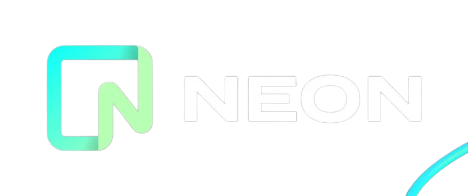

tags:: [[PostgreSQL]], [[Serverless Database]]

- # Neon
	- 
	- ## Neon Resources
		- [Neon — Serverless, Fault-Tolerant, Branchable Postgres](https://neon.tech/)
		- [GitHub - neondatabase/neon: Neon: Serverless Postgres. We separated storage and compute to offer autoscaling, branching, and bottomless storage.](https://github.com/neondatabase/neon)
		- [Neon documentation - Neon Docs](https://neon.tech/docs/introduction)
		- [Neon - YouTube](https://www.youtube.com/@neondatabase)