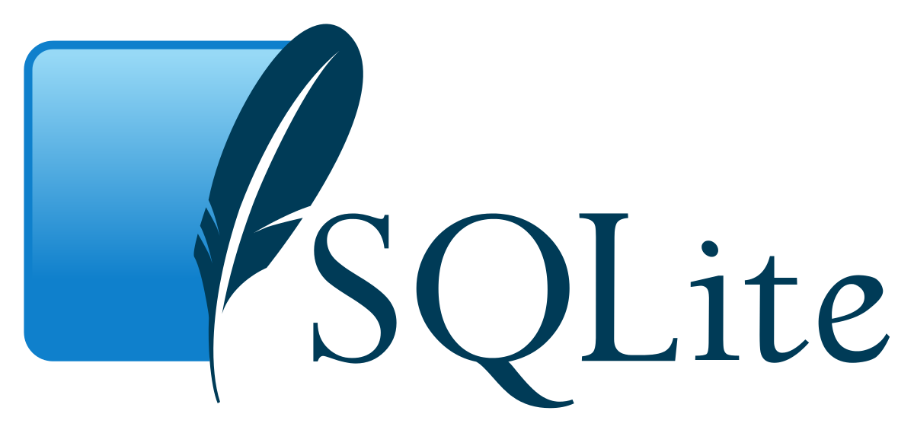

- # SQLite: The Underappreciated Database
	- 
	- ## What is SQLite
		- SQLite is a lightweight and efficient database management system renowned for its simplicity and effectiveness. Unlike traditional databases, SQLite operates as a self-contained library, eliminating the need for a separate server process. This note highlights the key features and advantages of SQLite and its diverse range of applications.
	- ## Features of SQLite
		- Simplicity and integration
			- SQLite stands out for its straightforward implementation and ease of integration. As a self-contained library, it seamlessly integrates into applications without complex setups or dependencies, making it a preferred choice for developers seeking simplicity.
		- Cross-platform compatibility
			- One of the notable strengths of SQLite is its compatibility across multiple operating systems, including Windows, macOS, Linux, Android, and iOS. This cross-platform compatibility allows developers to build applications that can run seamlessly on different platforms, providing flexibility and wider reach.
		- Embedded systems and mobile applications
			- SQLite excels in embedded systems and mobile applications due to its small memory footprint, small size of 500kb and efficient performance. It serves as the default database engine for iOS and Android platforms, enabling reliable data storage and management in resource-constrained devices such as smartphones, tablets, and IoT devices.
		- Reliability and data integrity
			- SQLite follows the ACID principles, ensuring data integrity and reliability. It supports transactions, enabling consistent and secure database operations. This reliability makes SQLite suitable for applications where data integrity is critical, even in the face of failures.
		- Versatility across domains
			- SQLite finds application in various domains. It serves as a local database solution for desktop software, web browsers, office suites, and media players, efficiently managing structured data. Additionally, SQLite is widely used in data analysis tools and research applications, thanks to its efficiency and simplicity. It also serves as a valuable educational tool for teaching database concepts and SQL programming.
	- ## Problems with SQLite
		- Limited concurrency
			- SQLite allows only one writer at a time, which means concurrent write operations may experience contention. However, it allows multiple readers simultaneously.
		- No support for network access
			- SQLite is designed as a serverless, embedded database and does not provide built-in support for network access. It is primarily meant for local or file-based operations.
		- No stored procedures
			- SQLite does not support stored procedures or user-defined functions written in programming languages like SQL Server's T-SQL or MySQL's PL/SQL. Instead, you can use triggers and custom functions.
		- Limited data types
			- SQLite has fewer data types compared to other database systems. It supports commonly used types like INTEGER, TEXT, REAL, BLOB, and NULL.
		- Lack of fine-grained access control
			- SQLite's access control is limited to read/write permissions at the database level. It does not offer fine-grained control over individual tables, columns, or rows like some other databases.
		- Limited ALTER TABLE operations
			- SQLite has certain limitations when altering existing tables. For example, you cannot directly drop a column from a table. Instead, you need to create a new table without the column and copy the data.
		- No support for full outer join
			- SQLite does not provide native support for full outer join operations. However, you can achieve similar results using unions and left/right joins.
		- No built-in replication or clustering
			- Unlike some other database systems, SQLite does not offer built-in features for replication or clustering. If you need to replicate or distribute your data across multiple nodes, you would need to implement custom solutions.
		- Limited query optimization
			- SQLite does not have sophisticated query optimization techniques compared to enterprise-level databases. While it performs well for many use cases, complex queries or large datasets may not benefit from advanced optimization strategies.
	- ## SQLite is also well suited for small to medium size web projects
		- SQLite is thought of as a small embedded database but in WAL mode SQLite is faster in reads than PostgreSQL or other relational databases so we can use it for some read heavy work loads like a web application. Some scalable backend projects like [[PocketBase]] use SQLite as the primary database.
		- SQLite is not scalable as other database but it can be used to run a moderate web project
			- There are a few projects which are built to scale SQLite to web scale with distributed consensus and stuff like
				- [[Dqlite]]
				- [[rqlite]]