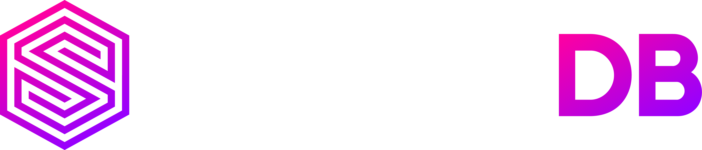

# SurrealDB: The ultimate Multi-Model Database for tomorrow's applications
	- 
	- ## SurrealDB
		- SurrealDB is a [[NewSQL]] [[Multi-Model Database]] written in [[Rust]].
		- With an SQL-style query language, real-time queries with highly-efficient related data retrieval, advanced security permissions for multi-tenant access, and support for performant analytical workloads, SurrealDB is the next generation serverless database. It literally has a features set that is surreal.
		- SurrealDB combines the best of [[Relational Databases]], [[Document Databases]], [[Key Value Databases]] and [[Graph Database]] in to a single light weight and preferment package which is [[ACID]] compliant and can  be queried with a SQL like syntax.
		- The magic behind SurrealDB is the [[SurrealDB/Record IDs]].
	- ## SurrealDB Features
		- It is Easy to pickup
			- There is no need to learn a new complicated database languages [[SurrealQL]] is SQL with some good to have syntactic sugar.
		- Support for multiple ways to query the database
			- Supports [[SurrealQL]] querying from client devices or servers, GraphQL querying, WebSocket querying, and HTTP querying. This gives great flexibility on how to query the database.
		- Granular access control
			- Provides row-level permissions-based access control, giving you the ability to manage data access with precision. This is important for ensuring that the data is secure and that only authorized users can access it.
		- Scalability and performance
			- Scalable and performant database that can handle high volumes of traffic. It is also designed to be fault-tolerant, so the data is always safe even if there is a problem with the database server.
			- It uses [[TiKV]] to run in a distributed scalable system that can handle [[Terabytes]]'s of data.
		- Ease of use
			- Easy to use and deploy. It comes with a comprehensive set of documentation and tutorials, and there is an active community of users who can help you if you need it.
		- ACID compliance
			- SurrealDB is a fully [[ACID]] compliant database, which means that your data is always consistent and reliable.
		- Geospatial support
			- Support for geospatial querying, which makes it ideal for applications that need to work with spatial data.
		- Full-text indexing
			- Supports full-text indexing, which makes it easy to search your data for specific keywords or phrases.
		- Embedded mode
			- Can be embedded in your application, which gives you more control over how your data is stored and accessed.
		- Schema Full or Schema Less mode
			- This means the data can be defined with a strict schema like in [[PostgreSQL]] or can be stored without a schema like in [[MongoDB]].
	- ## SurrealDB Problems
		- Has a learning curve to the new way of data modeling.
		- Still a new product and not mature as other databases.
		- Though [[SurrealQL]] is like SQL there is still a small learning curve.
		- There aren't many tools built around SurrealDB.
		- There is still no cloud-hosted option (there is a waitlist for the cloud-hosted version).
		- There is not a lot of documentation available for SurrealDB, so it can be difficult to learn how to use it.
		- There are still some bugs in SurrealDB that can cause unexpected behavior.
		- SurrealDB is not as performant as some other graph databases.
		- SurrealDB does not have all of the features that some other graph databases have.
	- ## SurrealDB Resources
		- [SurrealDB | The ultimate database for tomorrow's applications](https://surrealdb.com/)
		- [GitHub - surrealdb/surrealdb: A scalable, distributed, collaborative, document-graph database, for the realtime web](https://github.com/surrealdb/surrealdb)
		- [SurrealDB | Documentation](https://surrealdb.com/docs)
		- [SurrealDB Query Explorer | Surrealist](https://surrealist.starlane.studio/)
		- [SurrealDB - YouTube](https://www.youtube.com/channel/UCjf2teVEuYVvvVC-gFZNq6w)
	- {{video https://www.youtube.com/watch?v=C7WFwgDRStM}}
	- {{video https://www.youtube.com/watch?v=LCAIkx1p1k0}}