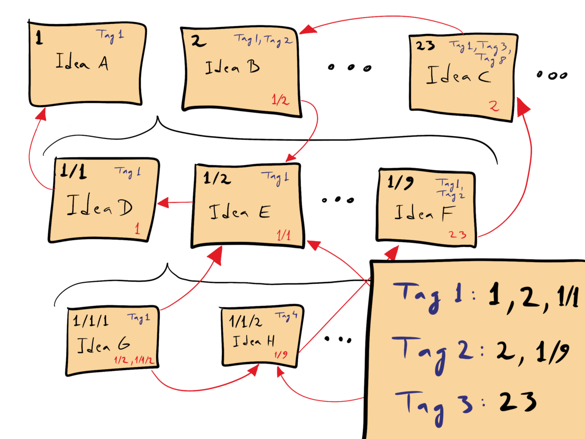
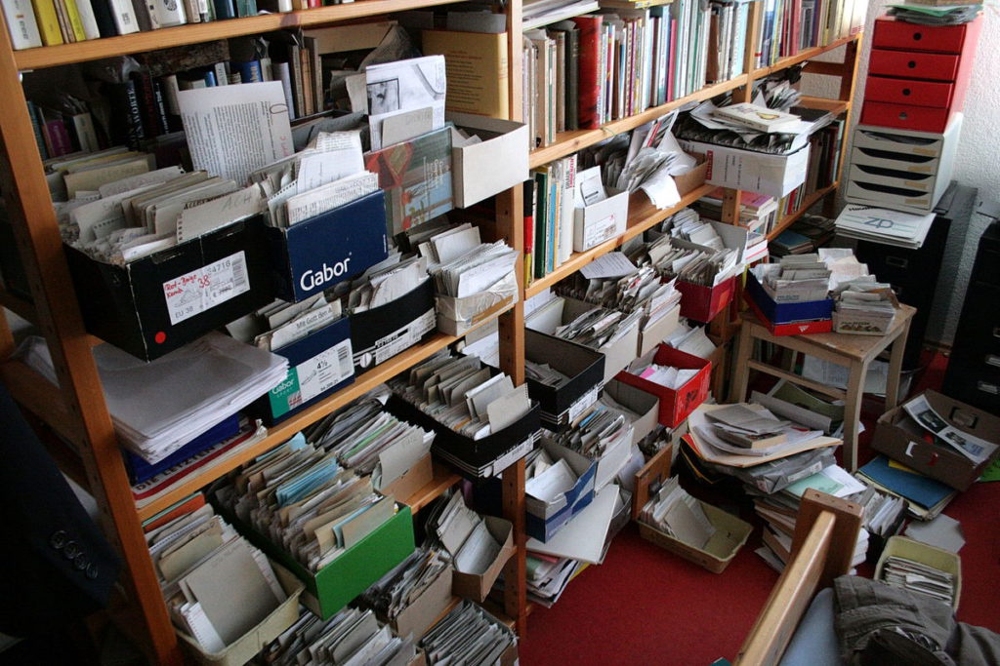

- # The Zettelkasten: Why It’s So Powerful
  id:: 648852a0-d63b-4064-a8e5-20d8ee1acf7c
	- 
	- ## What is a Zettelkasten
		- Zettelkasten means "Slip Box" method.
		- This highly effective knowledge management methodology originated from [Conrad Gessner](https://en.wikipedia.org/wiki/Conrad_Gessner) a Swiss scientist from 1500s.
		- Modern researchers like [Niklas Luhmann](https://en.wikipedia.org/wiki/Niklas_Luhmann) who wrote [400 research articles and over 70 books](https://scholar.google.com/scholar?start=0&q=author:Niklas+author:Luhmann), continues to prove the viability and efficiency of this methodology. His Zettelkasten had a mindboggling 90,000 index cards which were built up over 40 years. This is just one such example of Zettelkasten, or Second Brain which has given near superhuman capability to researchers.
		  id:: 64892712-6b5a-4775-869f-011609fe9031
		- ### The philosophy behind the Zettelkasten
			- At the core of the Zettelkasten philosophy assumes better organization, better note recall, and improved processes for idea generation help drive productivity.
			- The method involves building a set of networked and connected notes, linking ideas, thoughts, and information, which tries to mimic how the human brain functions. Each note or "slip" in a Zettelkasten represents a single idea or topic. Each note is connected to related ideas through a network of notes. These notes should preferably be [[Atomic Notes]].
			- Note topics can naturally develop during research, brainstorming, studying, or generally anywhere at any time. So there are no limits or bounds to this. The larger a Zettelkasten grows more powerful it becomes by allowing the owner to follow threads, unlock new connections, and explore new sequential thoughts.
			- Traditionally researchers wrote on paper notecards and filed them by hand in boxes and cabinets as shown belove. Which looked like a pile of cluttered trash to outsiders, but all those organized notes support a clean, structured mind with idea-generating resources.
				- 
			- But now there are digital tools like Logseq, and Obsidian to build 
			  a Zettelkasten which will negate all the complexity of a physical system.
	- ### Foundational concepts of Zettelkasten
		- **Notes contain discrete pieces of information**
			- One note per topic or thought. This structure the note cleanly and limits the information to a few sentence or paragraph. The notes should be a [[Atomic Notes]].
		- **Notes are organized by location and there are no categories**
			- This is quite nuanced. With a physical Zettelkasten, categorizing a topic is a nightmare, because a single note could belong to multiple categories. Let's say "Toyota Supra 2JZ 1998" This can belong to Sports cars and Toyota cars this would be a pain to categorize in a physical Zettelkasten, But in modern Zettelkasten they can be arranged with tags and links to multiple categorize at once.
		- **Notes have clear, unique titles**
			- Use descriptive words or a time or some form of unique. Duplicate names are a no-no.
		- **All notes should be linked**
			- A note without a link becomes an orphan which wanders like a sad stray thought we get at 2 A.M at night. Linked notes are happy notes which make the owner of the Zettelkasten happy.
		- **Keywords are cross-referenced**
			- Our prolific Dr Luhmann built a reference guide to help him find important keywords and their associated notes. This is a time-consuming process with physical cards but is automatic for a digital Zettelkasten with tags, links and, search capabilities.